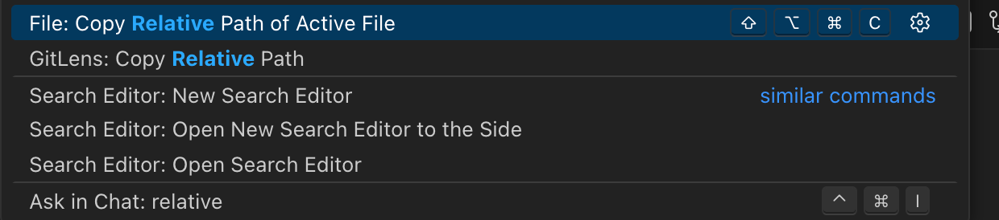
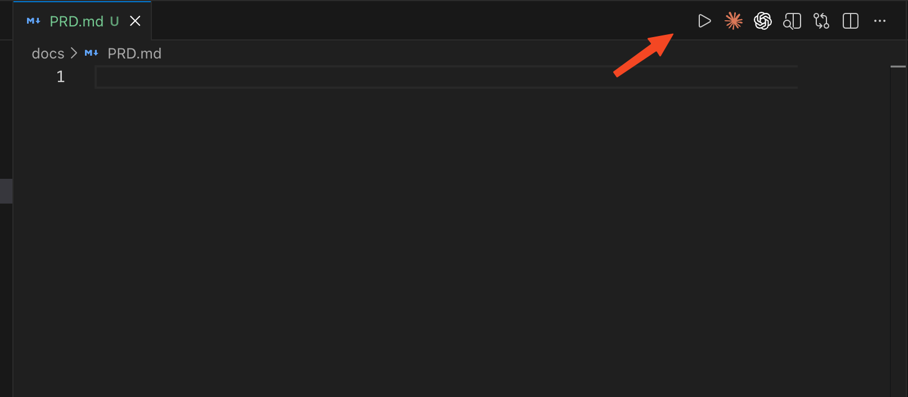

- #脑洞
- 为什么有这个脑洞
  - 有的时候我们要把文件发给大模型，但是有的插件不支持直接拖拽，所以需要把相对路径发给它，但是我不想在vscode 中通过打开命令面板，搜索 relative，回车来实现，然后快捷键我也不想记不想修改，所以还是觉得写一个浏览器插件，点击一个按钮就能复制最方便。
  - 
- 要做什么
  - 在打开的文件的右上角新增一个复制按钮，点击之后就可以复制相对路径
  - 
